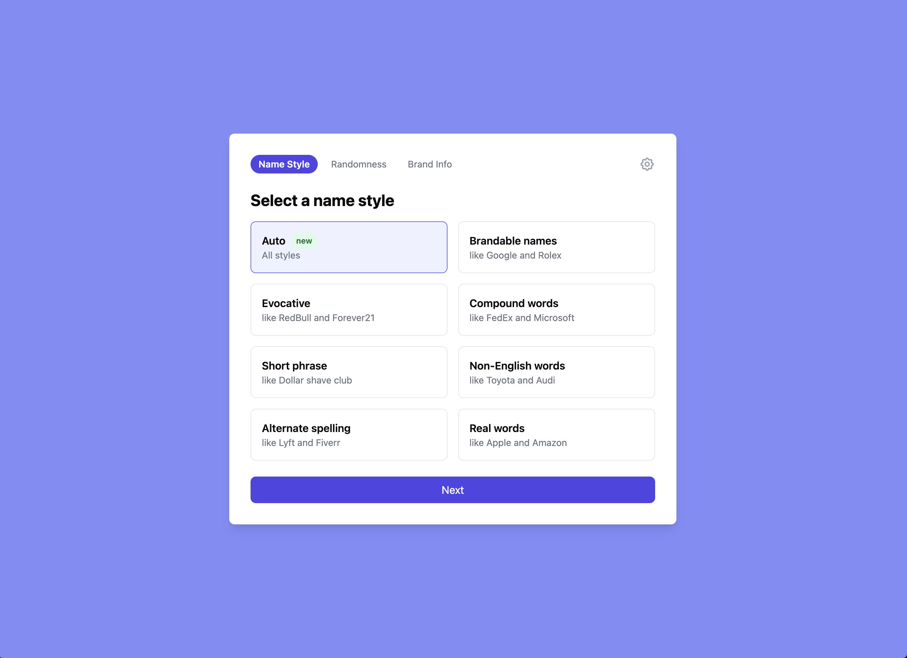
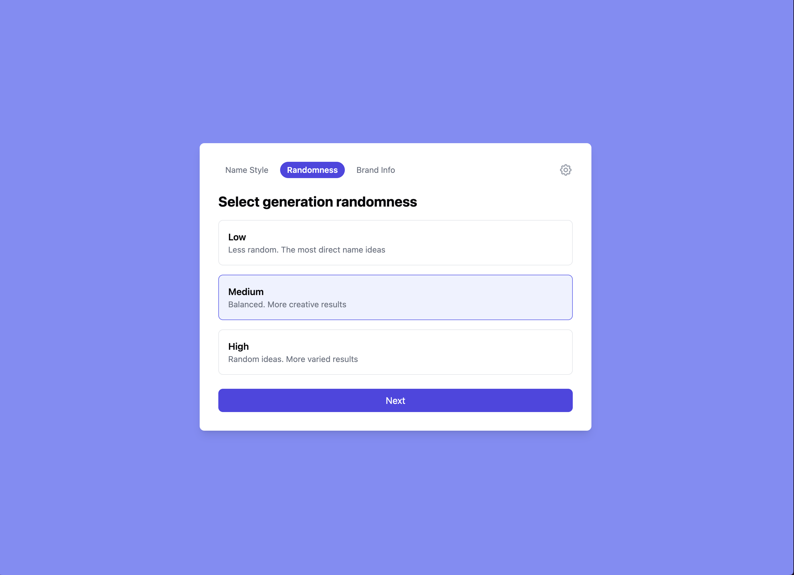
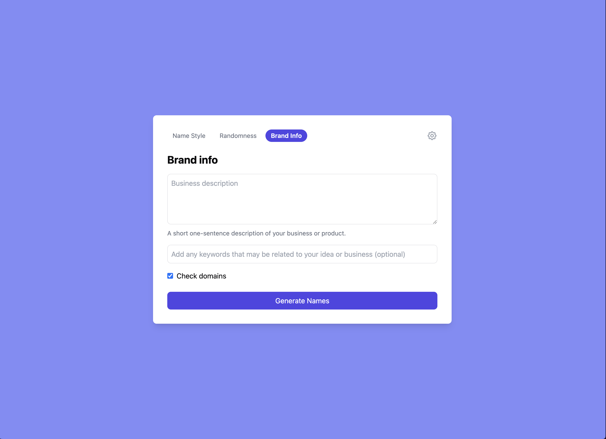
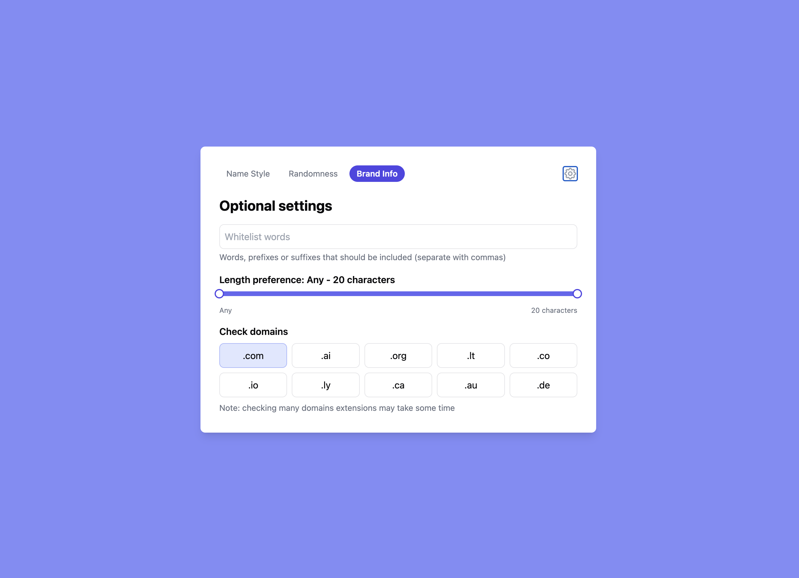
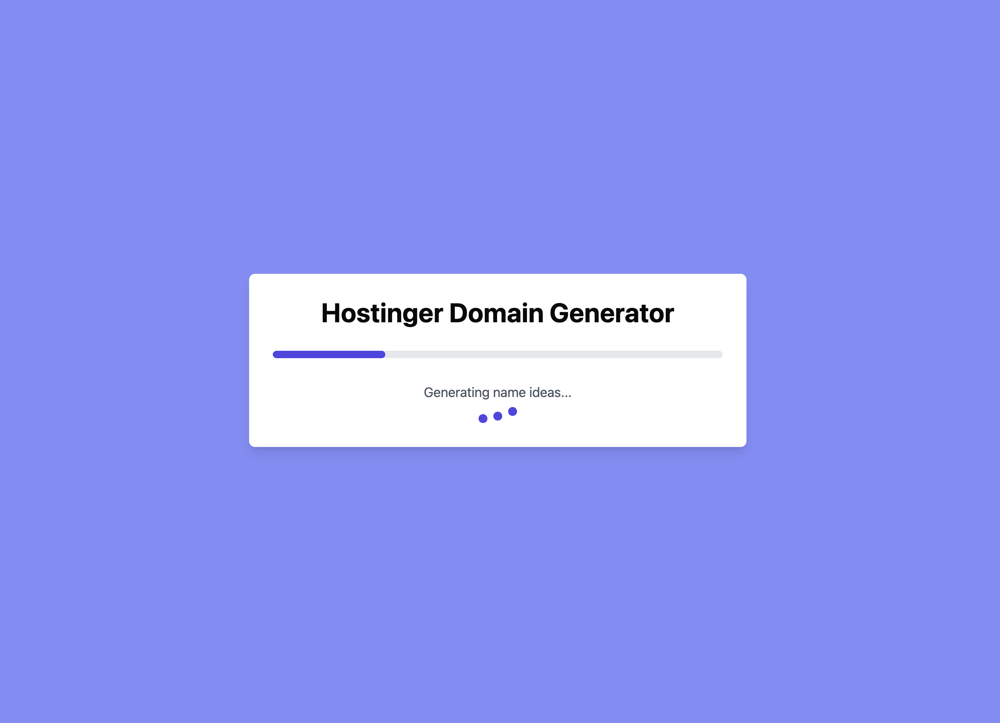
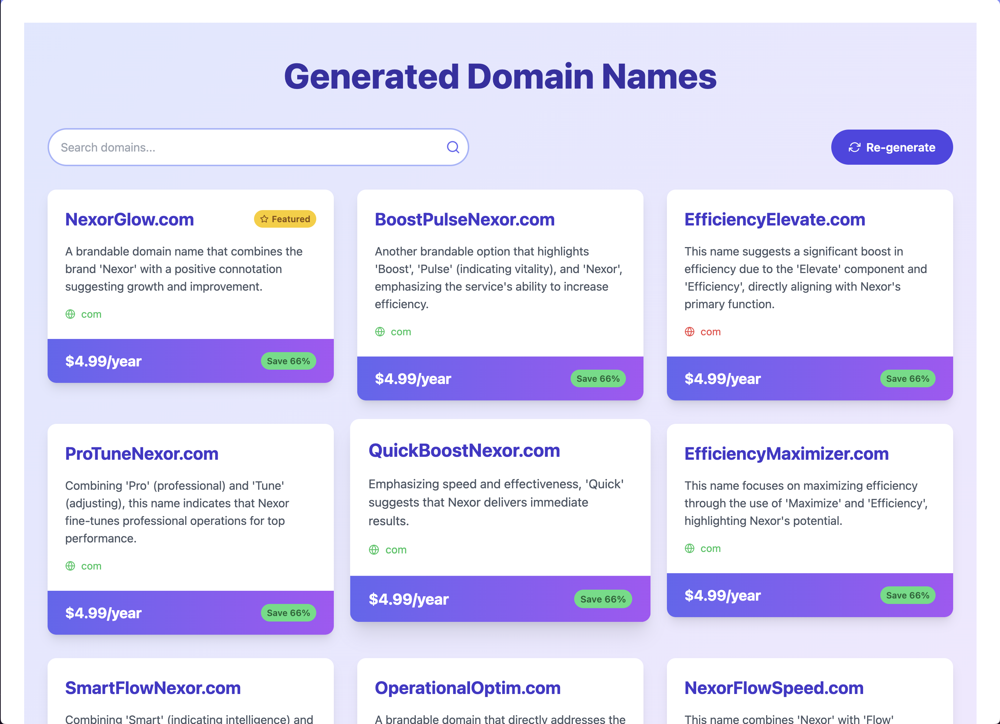
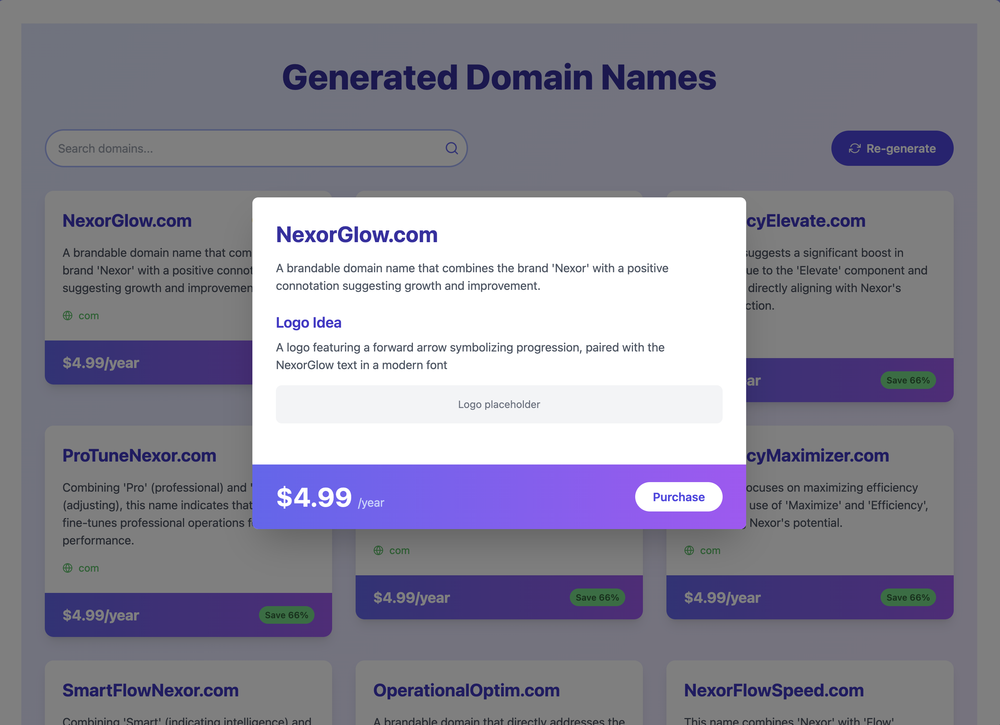

# Full Stack Application Documentation

## Overview

This is a full stack application designed to provide a seamless user experience for generating domain names using advanced AI models. The application consists of a frontend, backend, and an AI service for domain name suggestions.

## Features

- **AI Integration**: Utilizes advanced natural language processing to understand user queries and provide relevant responses.
- **Domain Name Generation**: Generate creative and diverse domain names based on user input.
- **Customizable Prompts**: Tailor the domain name suggestions according to specific criteria such as style, length, and keywords.
- **Unique Domain Names**: Ensure that the generated domain names are unique every session generation.
- **Logo description**: Provide a description of the logo to be used in the image generator.
- **Domain Checker**: Check the availability of the generated domain names.
- **Hostinger API compatibility**: Compatible with Hostinger frontend.

## Installation

To set up the development environment for this application, it is recommended to use a `.devcontainer`. Follow the steps below to get started:

1. **Clone the Repository**:

   ```bash
   git clone https://github.com/Gincioks/domain-generator
   cd domain-generator
   ```

2. **Open in VS Code or Cursor**:
   Ensure you have Visual Studio Code or Cursor installed along with the Docker installed.

3. **Open the Project in a Dev Container**:

   - Open the project folder in VS Code.
   - Press `Open a Remote Window` and select `Reopen in Container`.

4. **Environment Variables**:

   - Copy the `.env.example` file to `.env`:
     ```bash
     cp .env.example .env
     ```
   - Update the `.env` file with the necessary environment variables.
   - Example `.env` is pre-configured for local Ollama outside of the dev container on port `11434`.
   - `.env.exampleoai` is pre-configured for OpenAI GPT-4o.

5. **Install Dependencies**:

   - The dev container will automatically install the necessary dependencies for both the frontend and backend.

6. **Start the Application**:

   - Once the container is up and running, you can start the application using the following commands
     (in new terminal in case if .dev configuration terminal is still left):

     ```bash
     # In one terminal, start the backend
     start-api

     # In another terminal, start the frontend
     start-web
     ```

7. **Setup models**:

   > Note: Only if using Ollama

   - Go to `http://localhost:8000/docs` and create the model using the `/create-model` endpoint (available models in scheme).
   - And load the model using the `/load-model` endpoint (not necessary, only for faster first response time).

## Usage

After starting the application, you can access the frontend at `http://localhost:8080` and the backend API at `http://localhost:8000`.
Swagger documentation for the API can be accessed at `http://localhost:8000/docs`.

> Note: for full Ollama in Github Codespaces go to `codespaces` branch.(port nightmare)

## Insights about the models

- OpenAI GPT-4o works the best out of the box(only when added system message. otherwise giving many halucinations). Can be used for synthetic data generation.
- Qwen-7B-Instruct with 8bit quantization works the best, but slow(tested on Macbook M2 16GB). Sometimes giving wrong response, but fine-tuning should fix that.
- Qwen2-7B-Instruct with 4bit quantization mostly gives missing required properties in function call and only one domain name at the time.
- Qwen2-1.5B-Instruct in fp16 is close to Qwen-7B-Instruct in terms of performance and quality. But mostly missing required properties in function call.

## Screenshots















## Troubleshooting

- App after generation gives `Something went wrong... Retrying...`: model generated wrong response or missed property. Automatically retrying with same settings.

- App gives only one domain name(case for open source models): Press re-generate for more results. Next re-generations will be faster and more results will be generated.
